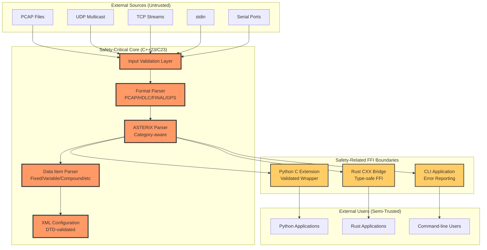
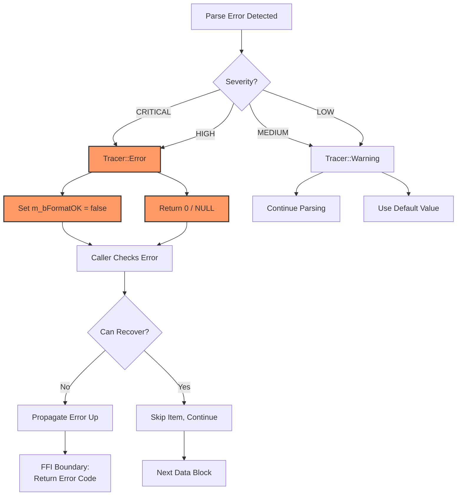
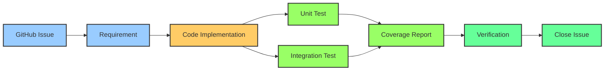

# Safety-Critical Design Patterns and Guidelines

**Document Version:** 1.0
**Date:** 2025-11-06
**Related:** Issue #26 - Establish safety-critical design patterns and guidelines (DO-278 alignment)
**Status:** Living Document

---

## Table of Contents

1. [Executive Summary](#executive-summary)
2. [Safety-Critical Context](#safety-critical-context)
3. [Architectural Safety Boundaries](#architectural-safety-boundaries)
4. [Core Safety-Critical Principles](#core-safety-critical-principles)
5. [Error Handling Philosophy](#error-handling-philosophy)
6. [Memory Management Strategy](#memory-management-strategy)
7. [FFI Boundary Safety Patterns](#ffi-boundary-safety-patterns)
8. [Testing Requirements](#testing-requirements)
9. [Static Analysis Requirements](#static-analysis-requirements)
10. [Runtime Assertion Strategy](#runtime-assertion-strategy)
11. [Performance Monitoring Requirements](#performance-monitoring-requirements)
12. [Traceability Framework](#traceability-framework)
13. [References and Standards](#references-and-standards)

---

## Executive Summary

The ASTERIX decoder is used in **Air Traffic Management (ATM)** systems for processing surveillance data in real-time. This document establishes safety-critical design patterns aligned with **DO-278A** (Software Integrity Assurance for Communication, Navigation, Surveillance, and Air Traffic Management Systems) principles without claiming formal certification.

### Key Safety Characteristics

- **Design Assurance Level:** Informational guidance aligned with DAL-C/D practices
- **Primary Hazard:** Incorrect parsing leading to loss of situational awareness
- **Safety Strategy:** Defense-in-depth with fail-safe parsing
- **Core Architecture:** Validated C++ core with hardened FFI boundaries
- **Coverage Targets:** >90% core parser, >80% bindings

### Scope of Safety-Critical Code

```
Total SLOC Analysis:
├── Safety-Critical (Core Parser)
│   ├── src/asterix/*.cpp/h         ~8,759 lines (C++23/C23)
│   ├── src/engine/*.cpp/h          ~2,100 lines (Device I/O)
│   └── Coverage Target: >90%
│
├── Safety-Related (FFI Boundaries)
│   ├── asterix-rs/src/*.rs         ~1,200 lines (Rust FFI)
│   ├── src/python/*.c/h            ~390 lines (Python C ext)
│   └── Coverage Target: >80%
│
└── Non-Safety-Critical
    ├── src/main/asterix.cpp        ~300 lines (CLI)
    ├── Wireshark plugins           ~800 lines
    └── Coverage Target: >60%
```

---

## Safety-Critical Context

### CNS/ATM Environment

**Communication, Navigation, Surveillance, and Air Traffic Management (CNS/ATM)** systems require:

1. **Deterministic Behavior** - Consistent parsing regardless of input load
2. **Fail-Safe Operation** - Parser errors must not crash the system
3. **Traceable Data** - All parsing decisions logged with timestamps
4. **Validated Input** - All external data treated as untrusted
5. **Predictable Performance** - Real-time constraints (<100ms for typical ASTERIX frame)

### DO-278A Alignment

This project follows DO-278A principles for software integrity assurance:

| DO-278A Principle | ASTERIX Implementation |
|-------------------|------------------------|
| **Requirements Traceability** | Issue tracking → Code → Tests (see [Traceability Framework](#traceability-framework)) |
| **Structural Coverage** | >90% core parser, >80% bindings (gcov/lcov) |
| **Defensive Programming** | Bounds checking, overflow detection, fail-safe defaults |
| **Error Handling** | Explicit error returns, no silent failures, comprehensive logging |
| **Coding Standards** | C++23 with modern safety features, compiler hardening |
| **Configuration Management** | Git version control, automated CI/CD validation |
| **Verification Testing** | Unit, integration, memory leak, fuzz testing |

**Important:** This project is **not formally certified** under DO-278A. These guidelines represent best-practice alignment for safety-critical software development.

---

## Architectural Safety Boundaries

The ASTERIX decoder uses a **layered architecture** with clear safety boundaries:



### Layer Responsibilities

#### Layer 1: Input Validation (Safety-Critical)

**Location:** `src/asterix/InputParser.cpp`, `src/asterix/asterixhdlcparsing.c`

**Responsibilities:**
- Validate all input data lengths before pointer arithmetic
- Detect and reject malformed frames/packets
- Implement fail-safe parsing (return 0 on any error)
- Prevent integer overflow in length calculations

**Example Pattern (GOOD):**
```cpp
// VULN-004 FIX: Fail-secure design in InputParser.cpp
if (dataLen <= 3 || dataLen > m_nDataLength) {
    break;  // Stop processing immediately, no OOB read possible
}

// VULN-002 FIX: 5-layer validation in HDLC parsing
if (offset + 3 > len) return 0;          // Header bounds
if (packet_len < 3) return 0;            // Minimum length
if (packet_len > len_to_check) return 0; // Packet bounds
if (offset + packet_len > len) return 0; // Frame boundary
```

#### Layer 2: Format Parsers (Safety-Critical)

**Location:** `src/asterix/asterixpcapsubformat.cpp`, `src/asterix/asterixhdlcsubformat.cpp`, etc.

**Responsibilities:**
- Parse encapsulation formats (PCAP, HDLC, FINAL, GPS)
- Extract ASTERIX data blocks from containers
- Buffer management with overflow protection
- CRC validation where applicable

**Safety Pattern:**
```cpp
// Buffer reuse optimization (Quick Win #5) with safety
static unsigned char buffer[BUFFER_SIZE];  // Reused across calls
if (nLength > BUFFER_SIZE) {
    Tracer::Error("Packet exceeds buffer size: %ld > %d", nLength, BUFFER_SIZE);
    return false;  // Fail-safe
}
memcpy(buffer, pData, nLength);  // Safe after length check
```

#### Layer 3: ASTERIX Core Parser (Safety-Critical)

**Location:** `src/asterix/DataRecord.cpp`, `src/asterix/DataBlock.cpp`, `src/asterix/Category.cpp`

**Responsibilities:**
- Parse ASTERIX data blocks and records
- FSPEC (Field Specification) parsing with bounds checking
- Category identification and UAP (User Application Profile) selection
- Data item extraction and validation

**Safety Pattern:**
```cpp
// FSPEC parsing with fail-safe design
do {
    unsigned char FSPEC = *m_pItemDataStart;
    lastFSPEC = (FSPEC & 0x01) ? false : true;

    // ... parse FSPEC bits ...

    m_pItemDataStart++;
    nFSPEC++;
    m_nFSPECLength++;
    nUnparsed--;
} while (!lastFSPEC && nUnparsed > 0);  // Bounded by remaining data

// Memory allocation with null check
m_pFSPECData = (unsigned char *) malloc(m_nFSPECLength);
if (m_pFSPECData == NULL) {
    Tracer::Error("Memory allocation failed for FSPEC data");
    return;  // Fail-safe: don't continue with null pointer
}
```

#### Layer 4: Data Item Parsers (Safety-Critical)

**Location:** `src/asterix/DataItemFormat*.cpp` (Fixed, Variable, Compound, Repetitive, Explicit, BDS)

**Responsibilities:**
- Parse individual ASTERIX data items per format type
- Handle nested/compound structures
- Integer overflow prevention in length calculations
- Bitfield extraction and value decoding

**Safety Pattern:**
```cpp
// VULN-001 FIX: Integer overflow detection in Repetitive items
long DataItemFormatRepetitive::getLength(const unsigned char *pData) {
    unsigned char nRepetition = *pData;
    long fixedLength = pF->getLength(pData + 1);

    // Check for integer overflow BEFORE multiplication
    if (nRepetition > 0 && fixedLength > (LONG_MAX - 1) / nRepetition) {
        Tracer::Error("Integer overflow in repetitive item: rep=%d, len=%ld",
                      nRepetition, fixedLength);
        return 0;  // Fail-safe
    }

    long totalLength = 1 + (long)nRepetition * fixedLength;

    // Sanity check: ASTERIX items shouldn't exceed 64 KB
    const long MAX_ASTERIX_ITEM_SIZE = 65536;
    if (totalLength > MAX_ASTERIX_ITEM_SIZE) {
        Tracer::Error("Repetitive item exceeds maximum size: %ld bytes", totalLength);
        return 0;  // Fail-safe
    }

    return totalLength;
}
```

#### Layer 5: FFI Boundaries (Safety-Related)

**Python C Extension** (`src/python/python_parser.h`, `python_wrapper.cpp`):
- Validated parameter passing (length, offset, blocks_count)
- Python exception handling for all error conditions
- Proper reference counting (Py_INCREF/DECREF)
- No raw pointer exposure to Python layer

**Rust CXX Bridge** (`asterix-rs/src/ffi.rs`):
- Type-safe FFI via CXX crate
- Integer overflow checks for usize→u32 casts
- Null pointer validation before dereferencing
- Ownership and lifetime enforcement at compile time

**See [FFI Boundary Safety Patterns](#ffi-boundary-safety-patterns) for detailed examples.**

---

## Core Safety-Critical Principles

### 1. Defensive Programming

**All external input is untrusted.** Every data source (file, network, stdin) may contain:
- Malformed ASTERIX data
- Malicious payloads (buffer overflow exploits)
- Invalid length fields
- Out-of-range values

**Mitigation Strategy:**

```cpp
// GOOD: Multi-layer validation
bool validate_asterix_header(const unsigned char* data, size_t len) {
    // Layer 1: Minimum length
    if (len < 3) {
        Tracer::Error("ASTERIX header too short: %zu bytes", len);
        return false;
    }

    // Layer 2: Category range
    unsigned char category = data[0];
    if (category == 0 || !AsterixDefinition::instance().isCategoryDefined(category)) {
        Tracer::Error("Invalid ASTERIX category: %d", category);
        return false;
    }

    // Layer 3: Data block length
    unsigned int dataLen = (data[1] << 8) | data[2];
    if (dataLen < 3 || dataLen > len) {
        Tracer::Error("Invalid data block length: %u (available: %zu)", dataLen, len);
        return false;
    }

    return true;  // All checks passed
}
```

```cpp
// BAD: Trust input length
unsigned int dataLen = (data[1] << 8) | data[2];
parse_asterix_block(data, dataLen);  // ❌ No validation!
```

### 2. Fail-Safe Defaults

**When in doubt, fail safely.** Parsing errors should:
- Return immediately without crashing
- Log the error with context (offset, category, reason)
- Set error flags to prevent downstream processing
- Never continue with corrupted state

```cpp
// GOOD: Fail-safe pattern
if (error_detected) {
    Tracer::Error("Parsing failed at offset %lu: %s", offset, reason);
    m_bFormatOK = false;  // Mark record as invalid
    return 0;             // Fail-safe return
}

// BAD: Attempt recovery
if (error_detected) {
    // Try to guess the correct value
    dataLen = m_nDataLength;  // ❌ Corrupted state!
    // Continue parsing...      ❌ Undefined behavior!
}
```

### 3. Bounded Operations

**All loops must have bounded iteration counts.** Prevent infinite loops from malicious input:

```cpp
// GOOD: Bounded FSPEC parsing
do {
    unsigned char FSPEC = *m_pItemDataStart;
    lastFSPEC = (FSPEC & 0x01) ? false : true;

    // ... process FSPEC byte ...

    m_pItemDataStart++;
    nUnparsed--;
} while (!lastFSPEC && nUnparsed > 0);  // ✅ Bounded by data length

// BAD: Unbounded loop
do {
    unsigned char FSPEC = *m_pItemDataStart;
    lastFSPEC = (FSPEC & 0x01) ? false : true;
    m_pItemDataStart++;
} while (!lastFSPEC);  // ❌ Can loop forever if data corrupted!
```

### 4. No Silent Failures

**All errors must be logged.** Use the `Tracer` singleton for consistent error reporting:

```cpp
// GOOD: Explicit error logging
if (!pUAP) {
    Tracer::Error("UAP not found for category %d", m_pCategory->m_id);
    return;  // Fail-safe
}

// GOOD: Contextual error information
if (usedbytes <= 0 || usedbytes > nUnparsed) {
    Tracer::Error("Wrong length in DataItem format for CAT%03d/I%s",
                  cat->m_id, di->m_pDescription->m_strID.c_str());
    errorReported = true;
    break;
}

// BAD: Silent failure
if (!pUAP) {
    return;  // ❌ No indication of why it failed
}
```

### 5. Integer Overflow Prevention

**All arithmetic on untrusted input must check for overflow:**

```cpp
// GOOD: Overflow detection before multiplication
if (nRepetition > 0 && fixedLength > (LONG_MAX - 1) / nRepetition) {
    Tracer::Error("Integer overflow detected");
    return 0;  // Fail-safe
}
long result = 1 + (long)nRepetition * fixedLength;

// BAD: Unchecked arithmetic
long result = 1 + nRepetition * fixedLength;  // ❌ Can overflow!
```

**Common Overflow Scenarios:**
1. **Repetitive items:** `count * item_size`
2. **Offset arithmetic:** `base_offset + packet_len`
3. **Buffer allocation:** `num_items * sizeof(item)`
4. **usize → u32 casts** (Rust FFI)

### 6. Memory Safety

**All memory operations must be validated:**

```cpp
// GOOD: Check malloc return value
m_pFSPECData = (unsigned char *) malloc(m_nFSPECLength);
if (m_pFSPECData == NULL) {
    Tracer::Error("Memory allocation failed for FSPEC data");
    return;  // Fail-safe
}

// GOOD: RAII pattern for automatic cleanup
class DataRecord {
    ~DataRecord() {
        if (m_pFSPECData) free(m_pFSPECData);  // Automatic cleanup
        if (m_pHexData) free(m_pHexData);
    }
};

// BAD: Unchecked allocation
m_pFSPECData = (unsigned char *) malloc(m_nFSPECLength);
memcpy(m_pFSPECData, data, m_nFSPECLength);  // ❌ Crashes if malloc failed!
```

---

## Error Handling Philosophy

### Error Classification

| Severity | Example | Action | Recovery |
|----------|---------|--------|----------|
| **CRITICAL** | Null pointer dereference | Abort parsing | None - fail-safe |
| **HIGH** | Invalid category | Skip data block | Continue to next block |
| **MEDIUM** | Unknown data item | Log warning | Use default/skip item |
| **LOW** | Missing description | Use placeholder | Parse structure only |

### Error Reporting Hierarchy



### Error Propagation Pattern

```cpp
// Core Parser (C++) - Returns error indicators
long DataItem::parse(const unsigned char *pData, long len) {
    if (!m_pDescription || !m_pDescription->m_pFormat) {
        Tracer::Error("DataItem format not defined");
        return -1;  // Error indicator
    }

    m_nLength = m_pDescription->m_pFormat->getLength(pData);
    if (m_nLength <= 0 || m_nLength > len) {
        Tracer::Error("Invalid length: %ld (available: %ld)", m_nLength, len);
        return -1;  // Error indicator
    }

    return m_nLength;  // Success: bytes consumed
}

// Caller checks return value
long usedbytes = di->parse(m_pItemDataStart, nUnparsed);
if (usedbytes <= 0 || usedbytes > nUnparsed) {
    Tracer::Error("Parse failed for CAT%03d/I%s", cat->m_id, item_id);
    m_bFormatOK = false;  // Mark record as invalid
    break;  // Stop parsing this record
}
```

### FFI Error Handling

**Python C Extension:**
```c
// Convert C++ errors to Python exceptions
PyObject* parse(PyObject *self, PyObject *args) {
    const char *data;
    Py_ssize_t len;

    if (!PyArg_ParseTuple(args, "s#i", &data, &len, &verbose))
        return NULL;  // Python exception already set

    if (len <= 0) {
        PyErr_SetString(PyExc_ValueError, "Empty input data");
        return NULL;  // Python will raise ValueError
    }

    if (!bInitialized) {
        PyErr_SetString(PyExc_RuntimeError,
                        "ASTERIX parser not initialized. Call init() first.");
        return NULL;
    }

    PyObject *lstBlocks = python_parse((const unsigned char *)data, len, verbose);
    if (!lstBlocks) {
        // C++ error already logged via Tracer::Error
        PyErr_SetString(PyExc_RuntimeError, "Parsing failed");
        return NULL;
    }

    return lstBlocks;  // Success
}
```

**Rust FFI:**
```rust
// Type-safe error propagation via Result<T, E>
pub fn parse(data: &[u8], options: ParseOptions) -> Result<Vec<AsterixRecord>> {
    // Input validation
    if data.is_empty() {
        return Err(AsterixError::InvalidData("Empty input data".to_string()));
    }

    if data.len() > MAX_ASTERIX_MESSAGE_SIZE {
        return Err(AsterixError::InvalidData(
            format!("Input data too large: {} bytes (max {})",
                    data.len(), MAX_ASTERIX_MESSAGE_SIZE)
        ));
    }

    // Call C++ via FFI (unsafe block isolated)
    unsafe {
        let data_ptr = ffi::ffi::asterix_parse(
            data.as_ptr(),
            data.len(),
            options.verbose
        );

        if data_ptr.is_null() {
            return Err(AsterixError::NullPointer(
                "C++ parser returned null".to_string()
            ));
        }

        // Convert to Rust types
        let result = convert_asterix_data(data_ptr, &options);

        // Cleanup C++ memory
        ffi::ffi::asterix_free_data(data_ptr);

        result  // Returns Result<Vec<AsterixRecord>, AsterixError>
    }
}
```

---

## Memory Management Strategy

### C++ Core: Manual Memory Management with RAII

The C++ core uses manual memory management (malloc/free) for compatibility with C23 components and legacy code. **RAII (Resource Acquisition Is Initialization)** ensures automatic cleanup:

```cpp
class DataRecord {
public:
    DataRecord(Category *cat, int id, unsigned long len,
               const unsigned char *data, double nTimestamp)
        : m_pCategory(cat), m_nID(id), m_nLength(len),
          m_pFSPECData(NULL), m_pHexData(NULL), m_bFormatOK(false) {

        // Allocate resources
        m_pFSPECData = (unsigned char *) malloc(m_nFSPECLength);
        if (m_pFSPECData == NULL) {
            Tracer::Error("Memory allocation failed");
            return;  // Constructor fails gracefully
        }

        m_pHexData = (char *) calloc(m_nLength * 2 + 1, sizeof(char));
        if (m_pHexData == NULL) {
            Tracer::Error("Memory allocation failed for hex data");
            // m_pFSPECData will still be freed in destructor
            return;
        }

        // ... parsing logic ...
    }

    ~DataRecord() {
        // RAII: Automatic cleanup on destruction
        if (m_pFSPECData) free(m_pFSPECData);
        if (m_pHexData) free(m_pHexData);

        // Also cleanup list items
        std::list<DataItem *>::iterator it = m_lDataItems.begin();
        while (it != m_lDataItems.end()) {
            delete (DataItem *) (*it);
            it = m_lDataItems.erase(it);
        }
    }

private:
    unsigned char *m_pFSPECData;  // Owned pointer
    char *m_pHexData;              // Owned pointer
    std::list<DataItem *> m_lDataItems;  // Owned pointers in list
};
```

### Memory Leak Prevention

**Valgrind Integration:**
```bash
# Run memory leak tests (integration tests with Valgrind)
cd install/test
./valgrind_test.sh

# Expected output:
# All 11 tests pass
# 0 memory leaks detected
# 0 heap errors
```

**CI/CD Integration:**
```yaml
# .github/workflows/ci-verification.yml
- name: Memory Leak Check
  run: |
    cd install/test
    ./valgrind_test.sh
    # Fails CI if memory leaks detected
```

### Smart Pointers (Modern C++)

**Migrate to smart pointers when refactoring:**

```cpp
// GOOD: Modern C++ with unique_ptr (future refactoring)
class DataRecord {
    std::unique_ptr<unsigned char[]> m_pFSPECData;
    std::unique_ptr<char[]> m_pHexData;
    std::vector<std::unique_ptr<DataItem>> m_lDataItems;

    // No explicit destructor needed - automatic cleanup!
};

// CURRENT: Manual management (legacy compatibility)
class DataRecord {
    unsigned char *m_pFSPECData;
    char *m_pHexData;
    std::list<DataItem *> m_lDataItems;

    ~DataRecord() {
        if (m_pFSPECData) free(m_pFSPECData);
        if (m_pHexData) free(m_pHexData);
        // ... manual cleanup ...
    }
};
```

### FFI Memory Ownership

**Rust FFI (CXX Bridge):**
- **C++ allocates, C++ frees:** Opaque wrapper types owned by C++
- **Rust copies data:** All returned data copied to Rust-owned `Vec<AsterixRecord>`
- **No shared ownership:** Clear boundary at FFI layer

```rust
// Rust copies data from C++ (owned by Rust)
unsafe fn convert_asterix_data(
    data_ptr: *mut ffi::ffi::AsterixDataWrapper
) -> Result<Vec<AsterixRecord>> {
    let mut records = Vec::new();  // Rust-owned

    let block_count = ffi::ffi::asterix_data_block_count(data_ptr);

    for i in 0..block_count {
        let block_ptr = ffi::ffi::asterix_get_data_block(data_ptr, i);
        let record = convert_data_block(block_ptr)?;  // Copies data
        records.push(record);  // Ownership transferred to Vec
    }

    Ok(records)  // Rust owns all data, C++ can free its copy
}
```

**Python C Extension:**
- **Python refcounting:** All PyObject* properly INCREF/DECREF
- **C++ allocates, Python owns:** After conversion to PyDict/PyList
- **Explicit cleanup:** C++ data freed after Python objects created

```c
PyObject* python_parse(const unsigned char *pBuf, Py_ssize_t len, int verbose) {
    // C++ allocates
    AsterixData* pData = new AsterixData();
    inputParser->parse(pBuf, len, pData);

    // Convert to Python objects (Python now owns)
    PyObject* lstBlocks = PyList_New(0);
    for (auto block : pData->m_lDataBlocks) {
        PyObject* pyBlock = block->getData(verbose);  // Creates new PyDict
        PyList_Append(lstBlocks, pyBlock);  // INCREF
        Py_DECREF(pyBlock);  // Balance refcount
    }

    // C++ cleanup
    delete pData;

    return lstBlocks;  // Python owns, refcount = 1
}
```

---

## FFI Boundary Safety Patterns

Foreign Function Interface (FFI) boundaries are **safety-critical** because they cross language trust boundaries. All external input must be validated before passing to the C++ core.

### Python C Extension Safety Patterns

#### Pattern 1: Parameter Validation

```c
// GOOD: Comprehensive parameter validation
PyObject* parse_with_offset(PyObject *self, PyObject *args) {
    const char *data;
    Py_ssize_t len;
    unsigned int offset;
    unsigned int blocks_count;
    int verbose;

    // Parse arguments with type checking
    if (!PyArg_ParseTuple(args, "s#IIi", &data, &len,
                          &offset, &blocks_count, &verbose)) {
        return NULL;  // Python exception already set
    }

    // Validate data length
    if (len <= 0) {
        PyErr_SetString(PyExc_ValueError, "Empty input data");
        return NULL;
    }

    const size_t MAX_ASTERIX_MESSAGE_SIZE = 65536;  // 64 KB
    if (len > MAX_ASTERIX_MESSAGE_SIZE) {
        PyErr_SetString(PyExc_ValueError,
            "Input data too large (maximum 65536 bytes)");
        return NULL;
    }

    // Validate offset
    if (offset >= (unsigned int)len) {
        PyErr_SetString(PyExc_ValueError,
            "Offset exceeds data length");
        return NULL;
    }

    // Validate blocks_count (prevent DoS)
    const unsigned int MAX_BLOCKS_PER_CALL = 10000;
    if (blocks_count > MAX_BLOCKS_PER_CALL) {
        PyErr_SetString(PyExc_ValueError,
            "blocks_count exceeds maximum (10000)");
        return NULL;
    }

    // Check for integer overflow: offset + (blocks_count * avg_block_size)
    if (blocks_count > 0 && offset > UINT_MAX - (blocks_count * 256)) {
        PyErr_SetString(PyExc_ValueError,
            "Offset + blocks_count would overflow");
        return NULL;
    }

    // All validations passed - call C++ core
    return python_parse_with_offset(
        (const unsigned char *)data, len, offset, blocks_count, verbose
    );
}
```

```c
// BAD: No validation (CRITICAL VULNERABILITY)
PyObject* parse_with_offset(PyObject *self, PyObject *args) {
    const char *data;
    Py_ssize_t len;
    unsigned int offset;
    unsigned int blocks_count;
    int verbose;

    if (!PyArg_ParseTuple(args, "s#IIi", &data, &len,
                          &offset, &blocks_count, &verbose))
        return NULL;

    // ❌ No validation! Directly call C++
    return python_parse_with_offset(
        (const unsigned char *)data, len, offset, blocks_count, verbose
    );
    // Attack: offset=1000000, len=100 → out-of-bounds read!
}
```

#### Pattern 2: Reference Counting

```c
// GOOD: Proper reference counting
PyObject* build_data_dict(DataBlock* block) {
    PyObject* p = PyDict_New();  // refcount = 1

    // Add category
    PyObject* k1 = Py_BuildValue("s", "category");  // refcount = 1
    PyObject* v1 = Py_BuildValue("H", block->getCategory());  // refcount = 1
    PyDict_SetItem(p, k1, v1);  // INCREF k1 and v1 internally
    Py_DECREF(k1);  // Balance: k1 refcount back to 1 (owned by dict)
    Py_DECREF(v1);  // Balance: v1 refcount back to 1 (owned by dict)

    // ... more fields ...

    return p;  // Caller owns, refcount = 1
}

// BAD: Memory leak (refcount not balanced)
PyObject* build_data_dict(DataBlock* block) {
    PyObject* p = PyDict_New();

    PyObject* k1 = Py_BuildValue("s", "category");
    PyObject* v1 = Py_BuildValue("H", block->getCategory());
    PyDict_SetItem(p, k1, v1);  // INCREF k1 and v1
    // ❌ Missing Py_DECREF(k1) and Py_DECREF(v1)
    // k1 and v1 now have refcount = 2 (leaked!)

    return p;
}
```

#### Pattern 3: Exception Handling

```c
// GOOD: Consistent exception setting
PyObject* parse(PyObject *self, PyObject *args) {
    const char *data;
    Py_ssize_t len;
    int verbose;

    if (!PyArg_ParseTuple(args, "s#i", &data, &len, &verbose))
        return NULL;  // Exception already set by PyArg_ParseTuple

    if (len <= 0) {
        PyErr_SetString(PyExc_ValueError, "Empty input data");
        return NULL;  // ValueError will be raised in Python
    }

    if (!bInitialized) {
        PyErr_SetString(PyExc_RuntimeError,
            "ASTERIX parser not initialized. Call init() first.");
        return NULL;  // RuntimeError will be raised
    }

    PyObject *lstBlocks = python_parse((const unsigned char *)data, len, verbose);
    if (!lstBlocks) {
        PyErr_SetString(PyExc_RuntimeError, "Parsing failed");
        return NULL;
    }

    return lstBlocks;  // Success
}

// BAD: Inconsistent error handling
PyObject* parse(PyObject *self, PyObject *args) {
    const char *data;
    Py_ssize_t len;
    int verbose;

    if (!PyArg_ParseTuple(args, "s#i", &data, &len, &verbose))
        return NULL;

    if (!bInitialized) {
        printf("Not initialized!");  // ❌ Uses printf, not Python exception!
        return NULL;  // Python will raise SystemError (wrong exception type)
    }

    PyObject *lstBlocks = python_parse((const unsigned char *)data, len, verbose);
    return lstBlocks;  // ❌ No null check, will crash if parsing fails
}
```

### Rust FFI Safety Patterns

#### Pattern 1: Integer Overflow Prevention

```rust
// GOOD: Validate before usize → u32 cast
pub fn parse_with_offset(
    data: &[u8],
    offset: usize,
    blocks_count: usize,
    options: ParseOptions,
) -> Result<ParseResult> {
    if data.is_empty() {
        return Err(AsterixError::InvalidData("Empty input data".to_string()));
    }

    // CRITICAL: Validate offset fits in u32 BEFORE casting
    if offset > u32::MAX as usize {
        return Err(AsterixError::ParseError {
            offset,
            message: format!(
                "Offset {} exceeds FFI maximum (u32::MAX = {})",
                offset, u32::MAX
            ),
        });
    }

    if offset >= data.len() {
        return Err(AsterixError::ParseError {
            offset,
            message: format!("Offset {} exceeds data length {}", offset, data.len()),
        });
    }

    // CRITICAL: Validate blocks_count fits in u32 BEFORE casting
    if blocks_count > u32::MAX as usize {
        return Err(AsterixError::InvalidData(format!(
            "blocks_count {} exceeds FFI maximum (u32::MAX = {})",
            blocks_count, u32::MAX
        )));
    }

    // Additional sanity check
    const MAX_BLOCKS_PER_CALL: usize = 10000;
    if blocks_count > MAX_BLOCKS_PER_CALL {
        return Err(AsterixError::InvalidData(format!(
            "blocks_count {} exceeds maximum ({})",
            blocks_count, MAX_BLOCKS_PER_CALL
        )));
    }

    unsafe {
        // NOW safe to cast after validation
        let offset_u32 = offset as u32;
        let blocks_count_u32 = blocks_count as u32;

        let data_ptr = ffi::ffi::asterix_parse_offset(
            data.as_ptr(),
            data.len(),
            offset_u32,
            blocks_count_u32,
            options.verbose,
        );

        // ... rest of function ...
    }
}
```

```rust
// BAD: Unchecked cast (CRITICAL VULNERABILITY)
pub fn parse_with_offset(
    data: &[u8],
    offset: usize,
    blocks_count: usize,
    options: ParseOptions,
) -> Result<ParseResult> {
    unsafe {
        let data_ptr = ffi::ffi::asterix_parse_offset(
            data.as_ptr(),
            data.len(),
            offset as u32,         // ❌ Truncates if offset > u32::MAX
            blocks_count as u32,   // ❌ Truncates if blocks_count > u32::MAX
            options.verbose,
        );
        // Attack: offset = 0x1_0000_0000 → truncates to 0 → parses from beginning!
    }
}
```

#### Pattern 2: Null Pointer Validation

```rust
// GOOD: Validate all pointers before dereferencing
unsafe fn convert_data_block(
    block_ptr: *const ffi::ffi::DataBlockWrapper,
) -> Result<AsterixRecord> {
    // CRITICAL: Check for null pointer FIRST
    if block_ptr.is_null() {
        return Err(AsterixError::NullPointer(
            "C++ returned null data block".to_string()
        ));
    }

    // Safe to call FFI functions now
    let category = ffi::ffi::asterix_block_category(block_ptr);
    let length = ffi::ffi::asterix_block_length(block_ptr);
    let timestamp_ms = ffi::ffi::asterix_block_timestamp_ms(block_ptr);

    // Validate hex data pointer
    let hex_ptr = ffi::ffi::asterix_block_hex_data(block_ptr);
    let hex_data = if !hex_ptr.is_null() {
        std::ffi::CStr::from_ptr(hex_ptr as *const std::os::raw::c_char)
            .to_string_lossy()
            .to_string()
    } else {
        String::new()  // Safe default if null
    };

    // Validate JSON pointer
    let json_ptr = ffi::ffi::asterix_block_to_json(block_ptr);
    let items = if !json_ptr.is_null() {
        let json_str = ffi::c_string_to_rust(json_ptr)?;
        parse_items_from_json(&json_str)?
    } else {
        BTreeMap::new()  // Safe default if null
    };

    Ok(AsterixRecord {
        category,
        length,
        timestamp_ms,
        hex_data,
        items,
    })
}

// BAD: No null pointer checks
unsafe fn convert_data_block(
    block_ptr: *const ffi::ffi::DataBlockWrapper,
) -> Result<AsterixRecord> {
    // ❌ No null check! Will segfault if block_ptr is null
    let category = ffi::ffi::asterix_block_category(block_ptr);

    // ❌ No null check! Will segfault if hex_ptr is null
    let hex_ptr = ffi::ffi::asterix_block_hex_data(block_ptr);
    let hex_data = std::ffi::CStr::from_ptr(hex_ptr as *const std::os::raw::c_char)
        .to_string_lossy()
        .to_string();

    // ... rest of function ...
}
```

#### Pattern 3: Bounds Checking

```rust
// GOOD: Validate data size before FFI
pub fn parse(data: &[u8], options: ParseOptions) -> Result<Vec<AsterixRecord>> {
    // Empty data check
    if data.is_empty() {
        return Err(AsterixError::InvalidData("Empty input data".to_string()));
    }

    // Maximum size check (prevent DoS)
    const MAX_ASTERIX_MESSAGE_SIZE: usize = 65536;  // 64 KB
    if data.len() > MAX_ASTERIX_MESSAGE_SIZE {
        return Err(AsterixError::InvalidData(format!(
            "Input data too large: {} bytes (maximum {} bytes)",
            data.len(),
            MAX_ASTERIX_MESSAGE_SIZE
        )));
    }

    unsafe {
        let data_ptr = ffi::ffi::asterix_parse(
            data.as_ptr(),
            data.len(),
            options.verbose
        );

        if data_ptr.is_null() {
            return Err(AsterixError::NullPointer(
                "C++ parser returned null".to_string()
            ));
        }

        let result = convert_asterix_data(data_ptr, &options);
        ffi::ffi::asterix_free_data(data_ptr);

        result
    }
}

// BAD: No size limits
pub fn parse(data: &[u8], options: ParseOptions) -> Result<Vec<AsterixRecord>> {
    if data.is_empty() {
        return Err(AsterixError::InvalidData("Empty input data".to_string()));
    }

    unsafe {
        // ❌ No maximum size check
        // Attack: data.len() = usize::MAX → C++ allocates gigabytes → DoS
        let data_ptr = ffi::ffi::asterix_parse(
            data.as_ptr(),
            data.len(),
            options.verbose
        );
        // ...
    }
}
```

#### Pattern 4: Path Traversal Prevention

```rust
// GOOD: Validate file paths before FFI
pub fn load_category(xml_path: &str) -> Result<()> {
    // Empty check
    if xml_path.is_empty() {
        return Err(AsterixError::InvalidData(
            "Filename cannot be empty".to_string()
        ));
    }

    // Path traversal check (defense-in-depth)
    // Only block paths that START with ".." (e.g., ../../../etc/passwd)
    // Allow "/../" in middle of paths (from path.join within project)
    if xml_path.starts_with("../") || xml_path.starts_with("..\\") || xml_path == ".." {
        return Err(AsterixError::InvalidData(
            "Invalid filename: path traversal detected (..)".to_string()
        ));
    }

    // Length check
    if xml_path.len() > 4096 {
        return Err(AsterixError::InvalidData(
            "Filename too long (maximum 4096 characters)".to_string()
        ));
    }

    let c_str = std::ffi::CString::new(xml_path)?;

    unsafe {
        if ffi::asterix_load_category(c_str.as_c_str().to_str().unwrap()) {
            Ok(())
        } else {
            Err(AsterixError::InitializationError(format!(
                "Failed to load category file: {xml_path}"
            )))
        }
    }
}

// BAD: No path validation
pub fn load_category(xml_path: &str) -> Result<()> {
    let c_str = std::ffi::CString::new(xml_path)?;

    unsafe {
        // ❌ No validation
        // Attack: xml_path = "../../../etc/passwd" → reads arbitrary file!
        if ffi::asterix_load_category(c_str.as_c_str().to_str().unwrap()) {
            Ok(())
        } else {
            Err(AsterixError::InitializationError("Failed".to_string()))
        }
    }
}
```

### FFI Testing Requirements

**Every FFI function must have:**

1. **Error injection tests** - Invalid inputs (empty, null, oversized, negative)
2. **Boundary tests** - 0, 1, MAX-1, MAX values
3. **Overflow tests** - Integer overflow scenarios
4. **Null pointer tests** - C++ returns null
5. **Memory leak tests** - Valgrind/ASAN clean

**Example test suite:**

```python
# Python FFI tests (tests/test_ffi_validation.py)
import pytest
import asterix

def test_parse_empty_data():
    """Reject empty input"""
    with pytest.raises(ValueError, match="Empty input"):
        asterix.parse(b"", verbose=0)

def test_parse_too_large():
    """Reject oversized input"""
    huge_data = b"\x00" * (65536 + 1)  # 64 KB + 1
    with pytest.raises(ValueError, match="too large"):
        asterix.parse(huge_data, verbose=0)

def test_parse_with_offset_overflow():
    """Detect offset > data length"""
    data = b"\x00" * 100
    with pytest.raises(ValueError, match="exceeds"):
        asterix.parse_with_offset(data, offset=1000, blocks_count=1, verbose=0)

def test_parse_with_offset_integer_overflow():
    """Detect integer overflow in offset arithmetic"""
    data = b"\x00" * 100
    with pytest.raises(ValueError, match="overflow"):
        asterix.parse_with_offset(data, offset=0xFFFFFFFF, blocks_count=1, verbose=0)

def test_parse_with_blocks_count_limit():
    """Reject excessive blocks_count (DoS prevention)"""
    data = b"\x00" * 100
    with pytest.raises(ValueError, match="exceeds maximum"):
        asterix.parse_with_offset(data, offset=0, blocks_count=100000, verbose=0)
```

```rust
// Rust FFI tests (asterix-rs/tests/ffi_validation_tests.rs)
use asterix::{parse, parse_with_offset, ParseOptions, AsterixError};

#[test]
fn test_parse_empty_data() {
    let result = parse(&[], ParseOptions::default());
    assert!(matches!(result, Err(AsterixError::InvalidData(_))));
}

#[test]
fn test_parse_too_large() {
    let huge_data = vec![0u8; 65536 + 1];  // 64 KB + 1
    let result = parse(&huge_data, ParseOptions::default());
    assert!(matches!(result, Err(AsterixError::InvalidData(_))));
}

#[test]
fn test_parse_with_huge_offset() {
    let data = vec![0u8; 1000];
    let huge_offset = u32::MAX as usize + 1;  // Exceeds u32::MAX
    let result = parse_with_offset(&data, huge_offset, 10, ParseOptions::default());
    assert!(matches!(result, Err(AsterixError::ParseError { .. })));
}

#[test]
fn test_parse_with_huge_blocks_count() {
    let data = vec![0u8; 1000];
    let huge_count = u32::MAX as usize + 1;  // Exceeds u32::MAX
    let result = parse_with_offset(&data, 0, huge_count, ParseOptions::default());
    assert!(matches!(result, Err(AsterixError::InvalidData(_))));
}

#[test]
fn test_parse_offset_exceeds_length() {
    let data = vec![0u8; 100];
    let result = parse_with_offset(&data, 101, 10, ParseOptions::default());
    assert!(matches!(result, Err(AsterixError::ParseError { .. })));
}
```

---

## Testing Requirements

### Coverage Targets

| Component | Target | Measurement | Tools |
|-----------|--------|-------------|-------|
| **Core Parser** (src/asterix/) | >90% | Line + Branch | gcov/lcov |
| **FFI Boundaries** (Python/Rust) | >80% | Line + Branch | coverage.py / cargo-tarpaulin |
| **Engine Layer** (src/engine/) | >80% | Line + Branch | gcov/lcov |
| **CLI Application** (src/main/) | >60% | Line | gcov/lcov |

### Test Categories

#### 1. Unit Tests

**Purpose:** Validate individual functions/classes in isolation

**Location:**
- C++: `tests/cpp/` (Google Test framework)
- Python: `tests/` (pytest)
- Rust: `asterix-rs/src/*_tests.rs` (built-in test framework)

**Requirements:**
- All public API functions must have unit tests
- All error paths must be tested
- All boundary conditions (0, 1, MAX-1, MAX) tested

**Example:**
```cpp
// C++ unit test (Google Test)
TEST(DataItemFormatRepetitive, IntegerOverflow) {
    // Test VULN-001 fix
    unsigned char data[] = {255, 0x00};  // nRepetition=255, large fixedLength

    DataItemFormatRepetitive fmt;
    long result = fmt.getLength(data);

    EXPECT_EQ(result, 0);  // Should fail-safe on overflow
}

TEST(DataItemFormatRepetitive, MaxSizeExceeded) {
    // Test max size sanity check
    unsigned char data[] = {255, 0xFF, 0xFF};  // Would exceed 64 KB

    DataItemFormatRepetitive fmt;
    long result = fmt.getLength(data);

    EXPECT_EQ(result, 0);  // Should fail-safe
}
```

#### 2. Integration Tests

**Purpose:** Validate end-to-end parsing of real ASTERIX data

**Location:** `install/test/test.sh` (11 tests)

**Test Data:**
- `cat001.raw` - Category 001 (MONORADAR)
- `cat048.raw` - Category 048 (Transmission of Monoradar Data Target Reports)
- `cat062.raw` - Category 062 (System Track Data)
- PCAP files with network captures
- HDLC-framed data
- FINAL format data

**Requirements:**
- All supported categories tested
- All encapsulation formats (PCAP, HDLC, FINAL, GPS) tested
- Output format validation (JSON, XML, text)
- Performance benchmarks (parsing speed)

**Example:**
```bash
#!/bin/bash
# install/test/test.sh

# Test 1: CAT001 raw ASTERIX data
./asterix -f testdata/cat001.raw -j > output/cat001.json
diff output/cat001.json expected/cat001.json || exit 1

# Test 2: CAT048 PCAP encapsulation
./asterix -P -f testdata/cat048.pcap -jh > output/cat048_pcap.json
diff output/cat048_pcap.json expected/cat048_pcap.json || exit 1

# Test 3: Memory leak check
valgrind --leak-check=full --error-exitcode=1 \
    ./asterix -f testdata/cat062.raw -j > /dev/null
# Exit code 1 if memory leaks detected
```

#### 3. Memory Safety Tests

**Purpose:** Detect memory leaks, buffer overflows, use-after-free

**Tools:**
- **Valgrind** (Linux) - Heap analysis, leak detection
- **AddressSanitizer (ASAN)** - Buffer overflow, use-after-free
- **MemorySanitizer (MSAN)** - Uninitialized memory reads
- **UndefinedBehaviorSanitizer (UBSAN)** - Undefined behavior detection

**CI Integration:**
```yaml
# .github/workflows/ci-verification.yml
- name: Memory Leak Check
  run: |
    cd install/test
    ./valgrind_test.sh
    # Fails if any leaks detected

- name: AddressSanitizer
  run: |
    cmake -DCMAKE_BUILD_TYPE=Debug \
          -DCMAKE_CXX_FLAGS="-fsanitize=address -fno-omit-frame-pointer" \
          -DCMAKE_C_FLAGS="-fsanitize=address -fno-omit-frame-pointer" .
    make
    cd install/test && ./test.sh
    # Fails if ASAN detects issues
```

**Requirements:**
- All integration tests must pass under Valgrind (0 leaks)
- All tests must pass under ASAN/MSAN/UBSAN
- CI must fail if memory errors detected

#### 4. Fuzz Testing

**Purpose:** Find edge cases and crashes with random/malformed input

**Tools:**
- **AFL (American Fuzzy Lop)** - Coverage-guided fuzzer
- **libFuzzer** - LLVM's in-process fuzzer
- **cargo-fuzz** (Rust) - Rust fuzzing framework

**Fuzz Targets:**
```cpp
// fuzz/fuzz_parse.cpp (libFuzzer)
extern "C" int LLVMFuzzerTestOneInput(const uint8_t *data, size_t size) {
    if (size < 3 || size > 65536) return 0;  // Skip invalid sizes

    AsterixData* pData = new AsterixData();
    InputParser parser;

    // Fuzz the parser with random input
    parser.parse(data, size, pData);

    delete pData;
    return 0;  // Non-zero return = crash detected
}

// Build and run:
// clang++ -fsanitize=fuzzer,address fuzz_parse.cpp -o fuzz_parse
// ./fuzz_parse -max_total_time=3600  # Run for 1 hour
```

```rust
// asterix-rs/fuzz/fuzz_targets/fuzz_parse.rs (cargo-fuzz)
#![no_main]
use libfuzzer_sys::fuzz_target;
use asterix::{parse, ParseOptions};

fuzz_target!(|data: &[u8]| {
    // Fuzz the Rust FFI boundary
    let _ = parse(data, ParseOptions::default());
    // Should never crash, even with malformed input
});

// Run:
// cargo fuzz run fuzz_parse -- -max_total_time=3600
```

**Requirements:**
- Fuzz testing run for minimum 24 hours before release
- All crashes investigated and fixed
- Fuzz corpus saved for regression testing

#### 5. FFI Boundary Tests

**Purpose:** Validate language binding safety (Python, Rust)

**Location:**
- Python: `tests/test_ffi_validation.py`
- Rust: `asterix-rs/tests/ffi_validation_tests.rs`

**Test Matrix:**

| Test Case | Python | Rust | Expected |
|-----------|--------|------|----------|
| Empty data | ✅ | ✅ | ValueError / InvalidData error |
| Null pointer | ✅ | ✅ | RuntimeError / NullPointer error |
| Offset > length | ✅ | ✅ | ValueError / ParseError |
| Integer overflow | ✅ | ✅ | ValueError / ParseError |
| Oversized data | ✅ | ✅ | ValueError / InvalidData error |
| Excessive blocks_count | ✅ | ✅ | ValueError / InvalidData error |
| Path traversal | N/A | ✅ | InvalidData error |
| usize → u32 overflow | N/A | ✅ | ParseError |

**See [FFI Boundary Safety Patterns](#ffi-boundary-safety-patterns) for implementation examples.**

#### 6. Performance Regression Tests

**Purpose:** Ensure optimizations don't slow down parsing

**Benchmarks:**
- Parse 1 MB of ASTERIX data
- Parse 10,000 ASTERIX records
- Parse PCAP with 1,000 packets
- Measure throughput (records/sec)

**Baseline (post-optimizations):**
- C++ executable: ~15-20% faster than baseline (Quick Wins #1-#6)
- Python module: Similar to C++ (overhead in Python object creation)
- Rust bindings: Similar to C++ (minimal FFI overhead)

**CI Integration:**
```yaml
- name: Performance Regression Check
  run: |
    cd install/test
    ./benchmark.sh > results.txt
    python check_regression.py results.txt baseline.txt
    # Fails if >5% slowdown detected
```

---

## Static Analysis Requirements

### Required Static Analysis Tools

| Tool | Language | Purpose | CI Integration |
|------|----------|---------|----------------|
| **cppcheck** | C/C++ | Memory safety, buffer overflows, null derefs | ✅ ci-verification.yml |
| **clang-tidy** | C/C++ | Modern C++ best practices, code quality | ⚠️ Manual only |
| **CodeQL** | C++/Python/Rust | Security vulnerabilities, data flow | ✅ codeql.yml (weekly) |
| **cargo clippy** | Rust | Rust lints, common mistakes | ✅ rust-ci.yml |
| **cargo audit** | Rust | Dependency vulnerabilities | ✅ rust-ci.yml |
| **cargo deny** | Rust | License compliance, banned deps | ✅ rust-ci.yml |
| **Bandit** | Python | Security issues | ⚠️ Manual only |

### cppcheck Configuration

**Command:**
```bash
cppcheck --enable=all --inconclusive --xml --xml-version=2 \
    --suppress=missingIncludeSystem \
    src/asterix/ src/engine/ src/main/ \
    2> cppcheck-report.xml
```

**Suppressions:**
```
# cppcheck-suppressions.txt
missingIncludeSystem  # System headers not found (expected)
unusedFunction:src/wireshark-plugin/*  # Wireshark plugins have unused exports
```

**Required Checks:**
- ✅ Memory leaks (memleak)
- ✅ Buffer overruns (bufferAccessOutOfBounds)
- ✅ Null pointer dereference (nullPointer)
- ✅ Uninitialized variables (uninitvar)
- ✅ Use after free (useAfterFree)
- ✅ Integer overflow (integerOverflow)

**CI Integration:**
```yaml
- name: Static Analysis (cppcheck)
  run: |
    sudo apt-get install -y cppcheck
    cppcheck --enable=all --inconclusive --error-exitcode=1 \
        --suppress=missingIncludeSystem \
        src/asterix/ src/engine/ src/main/
```

### Compiler Warnings as Errors

**GCC/Clang Flags:**
```makefile
# Enable strict warnings
CXXFLAGS += -Wall -Wextra -Wpedantic -Werror

# Additional security warnings
CXXFLAGS += -Wformat-security       # Format string vulnerabilities
CXXFLAGS += -Wformat=2              # Strict format checking
CXXFLAGS += -Wconversion            # Implicit conversions (overflow)
CXXFLAGS += -Wsign-conversion       # Sign mismatches
CXXFLAGS += -Wnull-dereference      # Potential null dereferences
CXXFLAGS += -Wdouble-promotion      # Unintended float→double
CXXFLAGS += -Wshadow                # Variable shadowing

# C23 specific
CFLAGS += -Wimplicit-fallthrough    # Missing break in switch
```

**MSVC Flags:**
```cmake
# Enable strict warnings on Windows
if(MSVC)
    add_compile_options(/W4 /WX)  # Level 4 warnings, treat as errors
    add_compile_options(/analyze) # Static analysis
endif()
```

### Rust Clippy Configuration

**CI Command:**
```bash
cd asterix-rs
cargo clippy --all-features -- -D warnings  # Treat warnings as errors
```

**Clippy Lints:**
```toml
# asterix-rs/.cargo/config.toml
[target.'cfg(all())']
rustflags = [
    "-D", "warnings",                    # Deny all warnings
    "-D", "clippy::all",                 # All Clippy lints
    "-D", "clippy::pedantic",            # Pedantic lints
    "-D", "clippy::cargo",               # Cargo lints
    "-W", "clippy::nursery",             # Nursery lints (warn only)
    "-D", "unsafe_code",                 # Deny unsafe except in ffi.rs
]
```

**Allowed Unsafe Code:**
```rust
// Only allow unsafe in FFI module
#![forbid(unsafe_code)]  // Global deny

// ffi.rs: Explicitly allow unsafe for FFI
#[allow(unsafe_code)]
pub mod ffi {
    // Unsafe FFI code here
}
```

### CodeQL Security Queries

**Configuration:** `.github/workflows/codeql.yml`

**Query Suite:**
```yaml
- name: Initialize CodeQL
  uses: github/codeql-action/init@v4
  with:
    languages: cpp, python, rust
    queries: security-and-quality  # High-severity security issues
```

**Critical Queries (C++):**
- CWE-120: Buffer overflow
- CWE-190: Integer overflow
- CWE-476: Null pointer dereference
- CWE-119: Out-of-bounds access
- CWE-416: Use after free
- CWE-415: Double free
- CWE-401: Memory leak

**Critical Queries (Python):**
- CWE-079: Cross-site scripting (XSS)
- CWE-089: SQL injection
- CWE-078: OS command injection
- CWE-502: Deserialization of untrusted data

**Critical Queries (Rust):**
- CWE-416: Use after free (unsafe code)
- CWE-190: Integer overflow (as casts)
- CWE-476: Null pointer dereference (raw pointers)

---

## Runtime Assertion Strategy

### Debug vs. Release Assertions

**Debug Builds:** Comprehensive assertions for development

```cpp
// Debug mode: Full validation
#ifdef DEBUG
    #define ASTERIX_ASSERT(condition, message) \
        if (!(condition)) { \
            Tracer::Error("Assertion failed: %s at %s:%d", \
                          message, __FILE__, __LINE__); \
            abort(); \
        }
#else
    #define ASTERIX_ASSERT(condition, message) ((void)0)
#endif
```

**Release Builds:** Critical assertions only (fail-safe)

```cpp
// Release mode: Fail-safe without aborting
#ifndef DEBUG
    #define ASTERIX_CHECK(condition, message) \
        if (!(condition)) { \
            Tracer::Error("Runtime check failed: %s", message); \
            return 0;  /* Fail-safe return */ \
        }
#endif
```

### Assertion Categories

#### 1. Precondition Assertions

**Validate function inputs:**

```cpp
long DataItemFormatRepetitive::getLength(const unsigned char *pData) {
    // Precondition: pData must not be null
    ASTERIX_ASSERT(pData != NULL, "pData is null");

    // Precondition: m_lSubItems must not be empty
    ASTERIX_ASSERT(!m_lSubItems.empty(), "No subitem format defined");

    DataItemFormat *pF = m_lSubItems.front();
    ASTERIX_ASSERT(pF != NULL, "Subitem format is null");

    // ... rest of function ...
}
```

#### 2. Postcondition Assertions

**Validate function outputs:**

```cpp
long DataItemFormatRepetitive::getLength(const unsigned char *pData) {
    // ... calculation ...
    long totalLength = 1 + (long)nRepetition * fixedLength;

    // Postcondition: Result must be reasonable
    ASTERIX_ASSERT(totalLength > 0, "Calculated length is non-positive");
    ASTERIX_ASSERT(totalLength <= MAX_ASTERIX_ITEM_SIZE,
                   "Calculated length exceeds maximum");

    return totalLength;
}
```

#### 3. Invariant Assertions

**Validate class invariants:**

```cpp
class DataRecord {
public:
    void checkInvariants() const {
        #ifdef DEBUG
        ASTERIX_ASSERT(m_pCategory != NULL, "Category is null");
        ASTERIX_ASSERT(m_nLength > 0, "Length is non-positive");
        ASTERIX_ASSERT(m_nFSPECLength > 0, "FSPEC length is zero");
        ASTERIX_ASSERT(m_nFSPECLength <= m_nLength,
                       "FSPEC length exceeds total length");
        #endif
    }

    // Call after constructor and before destructor
    DataRecord(...) {
        // ... initialization ...
        checkInvariants();
    }
};
```

#### 4. Loop Invariant Assertions

**Validate loop conditions:**

```cpp
// FSPEC parsing loop
unsigned int nFSPEC = 0;
do {
    // Loop invariant: We have not exceeded data length
    ASTERIX_ASSERT(nUnparsed > 0, "Parsing beyond data end");

    unsigned char FSPEC = *m_pItemDataStart;
    lastFSPEC = (FSPEC & 0x01) ? false : true;

    // ... process FSPEC byte ...

    m_pItemDataStart++;
    nUnparsed--;
    nFSPEC++;

    // Loop invariant: FSPEC count is reasonable
    ASTERIX_ASSERT(nFSPEC < 256, "FSPEC count exceeded 256 bytes");

} while (!lastFSPEC && nUnparsed > 0);
```

### Production-Safe Assertions

**For safety-critical code, use fail-safe checks instead of aborting:**

```cpp
// PRODUCTION: Fail-safe checks (always enabled)
#define ASTERIX_CHECK_FAIL_SAFE(condition, message, fail_value) \
    if (!(condition)) { \
        Tracer::Error("Runtime check failed: %s at %s:%d", \
                      message, __FILE__, __LINE__); \
        return fail_value;  /* Fail-safe, don't abort */ \
    }

// Example usage
long DataItemFormatRepetitive::getLength(const unsigned char *pData) {
    ASTERIX_CHECK_FAIL_SAFE(pData != NULL, "pData is null", 0);
    ASTERIX_CHECK_FAIL_SAFE(!m_lSubItems.empty(), "No subitem format", 0);

    // ... rest of function ...
}
```

---

## Performance Monitoring Requirements

### Real-Time Constraints

**ASTERIX parsing must meet real-time requirements:**

| Operation | Target Latency | Maximum Latency | Monitoring |
|-----------|----------------|------------------|----------|
| Parse single ASTERIX record | <1 ms | 10 ms | Timestamped logging |
| Parse PCAP packet (10 records) | <10 ms | 100 ms | Profiling |
| Parse 1 MB UDP multicast stream | <100 ms | 500 ms | Benchmarking |

### Performance Metrics

#### 1. Throughput

**Measure records/second:**

```cpp
// Performance benchmark
#include <chrono>

void benchmark_asterix_parsing() {
    auto start = std::chrono::high_resolution_clock::now();

    int records_parsed = 0;
    for (int i = 0; i < 10000; i++) {
        AsterixData* pData = new AsterixData();
        inputParser->parse(testData, testDataLen, pData);
        records_parsed += pData->m_lDataBlocks.size();
        delete pData;
    }

    auto end = std::chrono::high_resolution_clock::now();
    auto duration = std::chrono::duration_cast<std::chrono::milliseconds>(end - start);

    double records_per_sec = (records_parsed * 1000.0) / duration.count();
    printf("Throughput: %.2f records/sec\n", records_per_sec);
}
```

#### 2. Memory Usage

**Monitor heap allocations:**

```cpp
// Track memory usage
class MemoryMonitor {
    static size_t peak_memory;
    static size_t current_memory;

public:
    static void* tracked_malloc(size_t size) {
        void* ptr = malloc(size);
        if (ptr) {
            current_memory += size;
            if (current_memory > peak_memory) {
                peak_memory = current_memory;
            }
        }
        return ptr;
    }

    static void tracked_free(void* ptr, size_t size) {
        free(ptr);
        current_memory -= size;
    }

    static void report() {
        printf("Peak memory usage: %zu bytes\n", peak_memory);
        printf("Current memory usage: %zu bytes\n", current_memory);
    }
};
```

#### 3. Profiling

**Use profiling tools to identify hotspots:**

```bash
# CPU profiling (Linux perf)
perf record -g ./asterix -f large_file.pcap -j > /dev/null
perf report  # Shows function call graph with percentages

# Heap profiling (Valgrind massif)
valgrind --tool=massif ./asterix -f large_file.pcap -j > /dev/null
ms_print massif.out.<pid>  # Shows heap usage over time
```

### CI Performance Gates

**Automatically fail CI if performance regresses:**

```yaml
# .github/workflows/ci-verification.yml
- name: Performance Regression Check
  run: |
    cd install/test
    ./benchmark.sh > current_results.txt

    # Compare against baseline
    python3 <<EOF
    import sys

    # Read baseline (stored in repo)
    with open('baseline_results.txt') as f:
        baseline = float(f.read().strip())

    # Read current results
    with open('current_results.txt') as f:
        current = float(f.read().strip())

    # Check for >5% regression
    regression = (baseline - current) / baseline * 100
    if regression > 5.0:
        print(f"Performance regression: {regression:.1f}%")
        sys.exit(1)  # Fail CI
    else:
        print(f"Performance: {regression:.1f}% change")
    EOF
```

---

## Traceability Framework

### Requirements → Code → Tests Mapping

**Maintain bidirectional traceability:**



### Traceability Matrix Example

| Requirement ID | Issue | Implementation | Unit Test | Integration Test | Status |
|----------------|-------|----------------|-----------|------------------|--------|
| REQ-001 | #26 | `DataItemFormatRepetitive.cpp:59-74` | `test_repetitive_overflow.cpp` | `test.sh` (CAT062) | ✅ Verified |
| REQ-002 | #26 | `asterixhdlcparsing.c:387-410` | `test_hdlc_bounds.cpp` | `test.sh` (HDLC) | ✅ Verified |
| REQ-003 | #29 | `asterix-rs/src/parser.rs:132-154` | `ffi_validation_tests.rs` | N/A | ✅ Verified |
| REQ-004 | #29 | `python_wrapper.cpp:128-157` | `test_ffi_validation.py` | N/A | ✅ Verified |

### Code Annotation for Traceability

**Tag code with requirement IDs:**

```cpp
// REQ-001: Integer overflow prevention in repetitive items
// See: Issue #26, VULN-001
// Test: tests/cpp/test_repetitive_overflow.cpp
long DataItemFormatRepetitive::getLength(const unsigned char *pData) {
    unsigned char nRepetition = *pData;
    long fixedLength = pF->getLength(pData + 1);

    // REQ-001: Check for integer overflow BEFORE multiplication
    if (nRepetition > 0 && fixedLength > (LONG_MAX - 1) / nRepetition) {
        Tracer::Error("Integer overflow in repetitive item: rep=%d, len=%ld",
                      nRepetition, fixedLength);
        return 0;  // Fail-safe
    }

    // ... rest of function ...
}
```

**Tag tests with requirement IDs:**

```cpp
// TEST: REQ-001 - Integer overflow prevention
// Verifies: DataItemFormatRepetitive::getLength() fails safely on overflow
TEST(DataItemFormatRepetitive, IntegerOverflowPrevention_REQ001) {
    // Scenario: nRepetition=255, fixedLength would overflow LONG_MAX
    unsigned char data[] = {255, 0x00};

    DataItemFormatRepetitive fmt;
    long result = fmt.getLength(data);

    // Expected: Fail-safe return 0
    EXPECT_EQ(result, 0);
}
```

### Git Commit Traceability

**Reference issues in commit messages:**

```bash
git commit -m "SECURITY: Fix integer overflow in repetitive items (VULN-001)

Implements REQ-001 from Issue #26.

- Add overflow detection before multiplication
- Add max size sanity check (64 KB limit)
- Add comprehensive error logging

Tested:
- Unit tests: test_repetitive_overflow.cpp
- Integration tests: install/test/test.sh (CAT062)
- Valgrind: 0 memory leaks

Closes #26"
```

### Documentation Traceability

**Link documentation to code:**

```markdown
## Integer Overflow Prevention (REQ-001)

**Issue:** #26
**Implementation:** `src/asterix/DataItemFormatRepetitive.cpp:59-74`
**Tests:** `tests/cpp/test_repetitive_overflow.cpp`, `install/test/test.sh`
**Verification:** CI passing, Valgrind clean, coverage >90%

**Description:**
Prevent integer overflow in repetitive item length calculations...
```

---

## References and Standards

### DO-278A Guidance

**RTCA DO-278A:** *Guidelines for Communication, Navigation, Surveillance, and Air Traffic Management (CNS/ATM) Systems Software Integrity Assurance*

**Key Principles Applied:**
1. **Requirements-based testing** - All features traceable to requirements
2. **Structural coverage analysis** - >90% line/branch coverage
3. **Defensive programming** - Bounds checking, overflow detection
4. **Error handling** - No silent failures, comprehensive logging
5. **Configuration management** - Git version control, automated CI/CD

**Note:** This project is NOT formally certified under DO-278A. These guidelines represent best-practice alignment.

### Coding Standards

**C++ Core Guidelines:**
- https://isocpp.github.io/CppCoreGuidelines/CppCoreGuidelines
- Focus: Modern C++23, RAII, bounds safety

**MISRA C++:2023:**
- https://misra.org.uk/
- Aerospace-grade coding standard
- Not fully compliant, but inspirational

**SEI CERT C++ Coding Standard:**
- https://wiki.sei.cmu.edu/confluence/pages/viewpage.action?pageId=88046682
- Security-focused guidelines

**Rust API Guidelines:**
- https://rust-lang.github.io/api-guidelines/
- Idiomatic Rust patterns

### Security References

**CWE (Common Weakness Enumeration):**
- CWE-120: Buffer Overflow
- CWE-190: Integer Overflow
- CWE-476: NULL Pointer Dereference
- CWE-119: Out-of-Bounds Access
- CWE-416: Use After Free

**CVE Database:**
- https://cve.mitre.org/
- Track known vulnerabilities in dependencies

**OWASP Top 10:**
- https://owasp.org/www-project-top-ten/
- Focus: Input validation, injection prevention

### ASTERIX Standards

**EUROCONTROL ASTERIX Specifications:**
- https://www.eurocontrol.int/asterix
- Defines binary protocol for CNS/ATM data exchange

**ASTERIX Category Specifications:**
- CAT001 - Monoradar Target Reports
- CAT048 - Transmission of Monoradar Data
- CAT062 - System Track Data
- (80+ categories total)

---

## Document Revision History

| Version | Date | Author | Changes |
|---------|------|--------|---------|
| 1.0 | 2025-11-06 | Claude Code | Initial version - Comprehensive safety-critical guidelines |

---

**End of Document**
